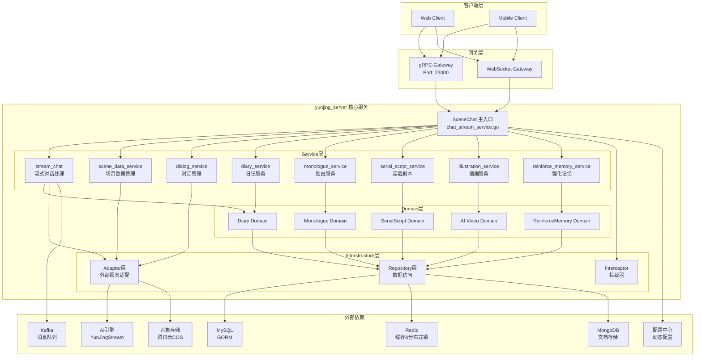
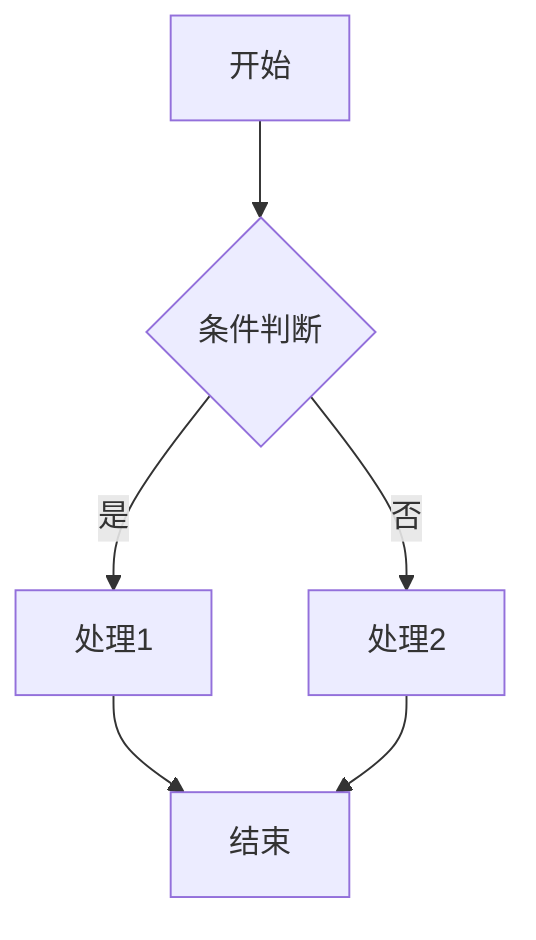
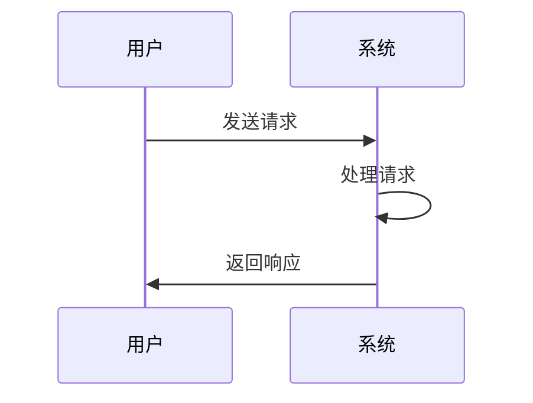

```mermaid
graph TB
    subgraph "客户端层"
        A[Web Client]
        B[Mobile Client]
    end

    subgraph "网关层"
        C[gRPC-Gateway<br/>Port: 23000]
        D[WebSocket Gateway]
    end

    subgraph "yunjing_server 核心服务"
        E[SceneChat 主入口<br/>chat_stream_service.go]

        subgraph "Service层"
            F[stream_chat<br/>流式对话处理]
            G[scene_data_service<br/>场景数据管理]
            H[dialog_service<br/>对话管理]
            I[diary_service<br/>日记服务]
            J[monologue_service<br/>独白服务]
            K[serial_script_service<br/>连载剧本]
            L[illustration_service<br/>插画服务]
            M[reinforce_memory_service<br/>强化记忆]
        end

        subgraph "Domain层"
            N[Diary Domain]
            O[Monologue Domain]
            P[SerialScript Domain]
            Q[ReinforceMemory Domain]
            R[AI Video Domain]
        end

        subgraph "Infrastructure层"
            S[Repository层<br/>数据访问]
            T[Adapter层<br/>外部服务适配]
            U[Interceptor<br/>拦截器]
        end
    end

    subgraph "外部依赖"
        V[MySQL<br/>GORM]
        W[Redis<br/>缓存&分布式锁]
        X[MongoDB<br/>文档存储]
        Y[Kafka<br/>消息队列]
        Z[AI引擎<br/>YunJingStream]
        AA[对象存储<br/>腾讯云COS]
        BB[配置中心<br/>动态配置]
    end

    A --> C
    B --> C
    A --> D
    B --> D

    C --> E
    D --> E

    E --> F
    E --> G
    E --> H
    E --> I
    E --> J
    E --> K
    E --> L
    E --> M

    F --> N
    I --> N
    J --> O
    K --> P
    M --> Q
    L --> R

    N --> S
    O --> S
    P --> S
    Q --> S
    R --> S

    F --> T
    G --> T
    H --> T

    E --> U

    S --> V
    S --> W
    S --> X
    F --> Y
    T --> Z
    T --> AA
    E --> BB
```

```mermaid
flowchart TB
    A[开始] --> B{条件判断}
    B -->|是| C[处理1]
    B -->|否| D[处理2]
    C --> E[结束]
    D --> E

```

```mermaid
sequenceDiagram
    participant User as 用户
    participant System as 系统
    User->>System: 发送请求
    System->>System: 处理请求
    System->>User: 返回响应
```